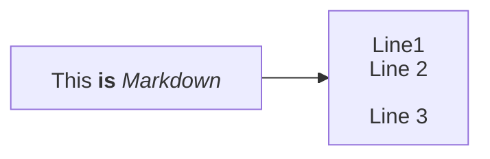

# mermaid-test

```mermaid
  info
```

```mermaid
---
config:
  htmlLabels: false
---
flowchart LR
    markdown["`This **is** _Markdown_`"]
    newLines["`Line1
    Line 2
    [link](https://example.com)
    Line 3`"]
    markdown --> newLines

```
